
<h2>Table of Contents</h2>

* [Introduction](#introduction) 
* [Background](#background)
* [Methodology](#methodology) 
* [Results](#results)
* [Recommendations & Next Steps](#recommendations--next-steps)
* [Detailed Graphs](#detailed-graphs)
* [References](references)

<a href="#top" class="back-to-top-link">🔝</a>

## Introduction  

Within the academic research environment there is an ever-increasing need for substantive digital research infrastructure (DRI), at both the national and institutional levels.  DRI refers to a suite of services that enables the collection, processing, dissemination and disposition of research data. In practice this is the software, code, large-scale computational facilities, and data storage facilities required in the research data lifecycle[^1].  While academic researchers have historically compiled, analyzed, and temporarily stored data, the growth in the technology and capacity to obtain large data sets, and the requirements to share data indefinitely, have radically changed the needs for services, support, and training for the research community. 

The University of British Columbia (UBC) has invested significantly in DRI, with over $26 million a year in operating expenses for research excellence, which includes DRI, in order to promote and enhance these services across both Vancouver and Okanagan campuses as well as affiliated research institutes and hospitals. Two units that are fundamental in providing these services are UBC Advanced Research Computing (UBC ARC) and UBC Library. UBC ARC and UBC Library partnered in 2021 to assess current training and support services offered across several elements of DRI at UBC through a needs assessment survey and focus groups. The objective of this DRI Needs Assessment was to conduct a substantive review of current DRI training and support utilized by UBC researchers. 

This report provides a summary of the findings and related recommendations to address identified gaps and encourage further utilization of the UBC DRI investment. 

## Background

As traditionally non-computational disciplines increasingly rely on digital methodologies or approaches, and computationally-centric disciplines need to navigate large and complex computational environments, there is a growing and widespread need to support the infrastructural demands of these research projects as well as to ensure that practitioners have the skillsets required to engage in these activities. 

Research intensive universities must invest in advanced research computing facilities, research data management services, data storage services and training, research software licenses and development, and highly qualified personnel to support this infrastructure[^2] if they wish to be competitive. This need is as much predicated on providing the necessary frameworks to enable research as it is to entice top tier researchers; prospective faculty increasingly inquire about this kind of investment, and more universities are offering cloud credits and support as ways to entice candidates. 

Access to, and support with, growing amounts of data is central to today’s research. “In the academic world, faculty understand this better than anyone because their careers hinge on publishing research in scholarly journals. Standing between every researcher and peer-reviewed publication, however, are mountains of messy logistics that must be removed to focus on what really matters: first-rate research design and analysis”[^3].  

UBC has recognized this is an area where financial and resource investment is required.  Substantive contributions have been made to advanced research compute infrastructure, including the hiring of new and re-imagining of existing positions in UBC ARC and UBC Library to support RDM, data, and digital scholarship across a range of disciplines, and supporting in kind contributions by engaging in national and regional partnerships to address many of the underlying issues that span the scope or capacity of any individual institution. While UBC ARC and UBC Library have positioned themselves to lead the provisioning of services and support related to DRI at a campus level, this work is contributed to in significant ways by several units, departments, and faculty specific resources on both campuses, each often working in relative isolation one from the other. 

### UBC ARC

UBC ARC was formally launched in 2015. However, the infrastructure it maintains and provides to researchers is relatively new.  In 2019, UBC ARC Sockeye, a 15,872 CPU and 200 GPU high performance computing system available to UBC researchers was unveiled as a complement to the national computing services supported by The Digital Research Alliance of Canada/Compute Canada Federation.  In 2020, UBC ARC Chinook, a 20 petabyte object storage platform was subsequently launched.  Combined, Sockeye and Chinook were enabled through capital investments totaling over C$18 million[^4].  Often, advanced research computing (ARC) services are provided through a traditional IT department, with staff having various levels of research experience. In contrast, UBC ARC is a multidisciplinary unit within the Office of the Vice President of Research and Innovation, comprised of staff members in traditional ARC roles such as system administrators, and former researchers, as well as less traditional members with backgrounds in areas such as health, oceanography, archeology, and library and information sciences. 

UBC ARC occupies a unique position at the intersection of high performance computing (HPC), research data management (RDM), and research software (RS), and leverages this position through collaboration with departments and portfolios spanning UBC to offer support and training across the range of DRI activities queried in this needs assessment.  Over the course of the last two years, UBC ARC staff have hosted a number of introductory courses on HPC, commercial cloud, and RDM.  

### UBC Library

As research outputs have grown to include not just journal articles and monographs, the role of the academic library is shifting. Two fundamental aspects of the academic library—development of and access to collections and training in information literacies—need to tackle and embrace managing digital objects, intermediary research objects, and critical literacies in using, navigating, and engaging with these materials. With this growth in digital outputs and the need for infrastructure that provides durable, accessible, and discoverable access, “academic libraries [...] face enormous changes in user expectations and information-seeking behaviour.” Like many institutions, UBC Library started hiring and cultivating expertise to address these expectations. Starting with a Research Data Management position in 2014, DRI related activities are now built directly into several positions that contribute to the campus community by developing digital research infrastructure resources for faculty, staff, and students. 

On the Vancouver campus, DRI activities such as RDM, tools for data visualization, statistical analysis, geospatial inquiries, and text analysis are supported by the Research Commons. On the Okanagan campus, the Centre for Scholarly Communication (CSC), launched in 2020, brings together expertise from the Library, Research Computing, and the Office of Research Services in a single portal to facilitate researcher access to training and support across the full scope of DRI activities queried in the needs assessment. 

UBC Library offers regular foundational workshops—supported by investments in people and spaces to host these events—funds and provides access to several research data repositories—UBC Dataverse, FRDR, and Dryad—and invests in the development of institutional and national platforms that enable the operationalization of RDM mandates such as the DMP Assistant.   

### Campus

Within the UBC context, often the two campuses, UBC Vancouver and UBC Okanagan are evaluated separately.  For the purposes of this needs assessment, it is worth noting that the support services and training infrastructures vary between the two campuses. 

### National DRI

In a similar fashion to UBC’s DRI support units operating in isolation from each other, at a national level, historically DRI has been supported by three, distinct organizations--Compute Canada, Portage, and CANARIE--responsible respectively for ARC, RDM, and RS. Operating as specific and separate services, approaches to building competency and capacity in these areas have lacked overlap. In an effort to address this, the Government provided C$375 million in funding to consolidate these organizations; the subsequent launch of the Digital Research Alliance of Canada represents a momentous integration of these three components of DRI nationally[^5].   

Parallel to this needs assessment of UBC researchers, the Alliance conducted a similar survey at the national level, which will be discussed in relevant sections within this report. 

## Methodology

Data collection for the needs assessment consisted of (1) a survey assessing current usage, awareness, and gaps in research data, software, and computational services, and (2) three follow-up focus groups with questions informed by survey results. 

### Data Availability

Survey responses were collected anonymously, except where participants could enter an email address to enter a draw or participate in focus groups. Any potentially identifying data points from both the survey--including emails, geolocation, and survey dissemination channel--and focus groups were removed before analysis. All data used for analysis is available at [address]. 

### Survey

The needs assessment survey was open from May 17 - June 12, 2021, and queried UBC researchers’ training and support needs in 25 distinct areas relating to data, software, and computational infrastructure (Table 1). Open to all UBC researchers--graduate students, post-doctoral fellows, and faculty--the survey was distributed online through UBC Library and UBC ARC communication channels, university-wide newsletters, and targeted groups known to use at least a subset of these services. A total of 241 responses were received. 

For the purpose of the survey, training and support were looked at as distinct services, with “training” defined as "single workshops, workshop series, online modules/videos, and formal courses", and “support” defined as "web resources, consultations, advising, troubleshooting, and recommendations". 

After entering demographic information, participants were presented with a list of 25 areas of DRI, and asked to select all those relevant to their research. Following this, each participant was asked to complete questions for each DRI element selected, including (1) whether they needed or wanted training/support, (2) if they sought training/support, and if so, (3) where they went and how satisfied they were with the training/support received. Participants were also given the option to submit free-text comments at the end of the survey.  For analysis, the 25 DRI elements were categorized into four groups, loosely based on their relationships with one another (Table 1). 

**Table 1.  25 DRI tools and services presented by group in Needs Assessment Survey**
 
 
 

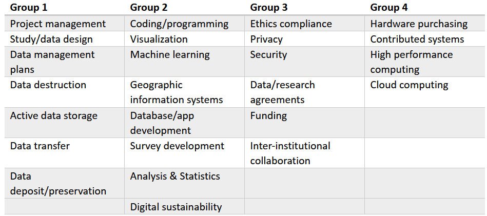

### Focus Groups

As part of the survey, participants were asked if they would be willing to participate in a focus group. Of the 23 respondents who provided contact information, 11 were scheduled for and participated in three focus groups.  Focus groups were semi-structured, containing scripted questions but also allowing spontaneous follow-up and discussion. For each session, two members from the assessment team were present, with one person leading the discussion and the other taking notes. Sessions were conducted via Zoom, and were recorded as well as transcribed using Zoom's built-in software. Videos were deleted after transcripts were exported to a secure storage platform, and all transcripts were stripped of identifiers. While transcripts weren't formally coded or analyzed, excerpts of relevance were extracted. 

### Limitations

The DRI Needs Assessment Survey was designed to evaluate awareness of and need for support and training in DRI. While free text fields allowed for respondents to provide additional qualitative feedback, the bulk of the survey focused on what was sought or needed, and less on why or at what level or in what modality these training and supports were needed or not needed. While the focus groups allowed a deeper dive into these issues, the pool of focus group participants represents a sample biased by size, discipline, volunteer bias, and scheduling parameters. Consequently, while this survey is able to report on the degree of awareness of DRI supports and training and the degree to which DRI training and supports are used and from which units or departments, further inquiry would enhance our understanding of specific training and support needs, modalities of delivery, and access points to increase awareness. 

## Results

### Demographics

The survey began by asking demographic information about participants' position at UBC, their discipline, as well as their primary work location at UBC. While Professors made up the largest group of respondents, there was strong representation across all groups except Instructors and Postdoctoral Fellows (Figure 1). In terms of research discipline, Medicine and Health Sciences, as well as the Social Sciences and Humanities made up a disproportionate number of respondents (Figure 2). The primary work location of respondents was largely the Vancouver campus, although there was significant representation from both the Okanagan campus as well as affiliated hospitals or institutions (Figure 3). When normalized to 2020 data for total number of graduate students and faculty, and grouping affiliated institutions with the UBC Vancouver campus, UBC Vancouver had a response rate of 1.3% and UBC Okanagan a response rate of 3.5%. 

**Figure 1**
 
 
 
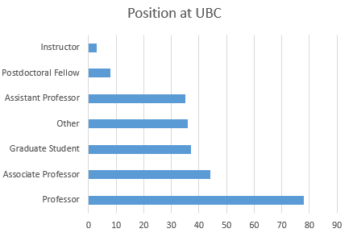

**Figure 2**
 
 
 
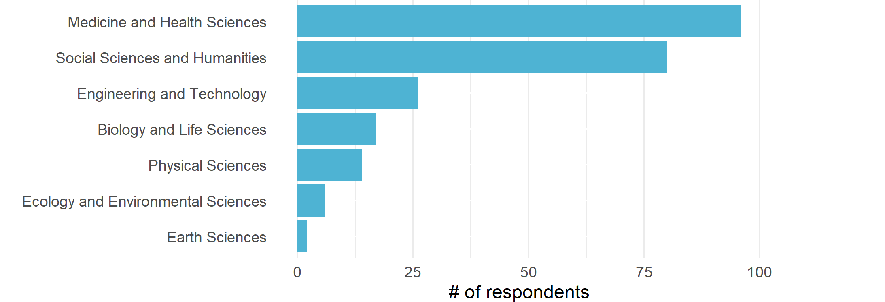

**Figure 3**
 
 
 
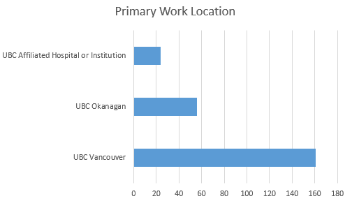

### Awareness

One of the most striking findings from the survey was the discrepancy between the relatively small number of those that sought training or support, compared to the much larger numbers of those that would have liked training or support but didn't know they were available (Figures 4 and 5). Of particular note is that this gap between those that sought training or support versus those that wanted it spans across nearly all of the 25 DRI elements and the respective portfolios and departments that serve these areas. This suggests that the issue of communication, or awareness, is systemic and not discipline specific or unique to a single aspect of DRI. 

**Figure 4**
 
 
 
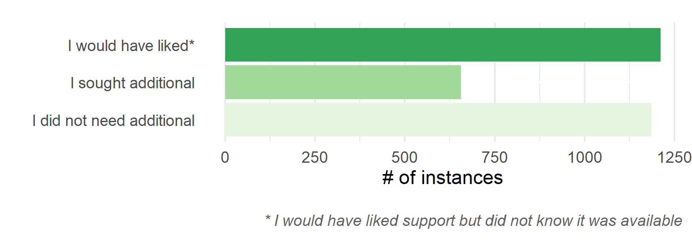

**Figure 5**
 
 
 
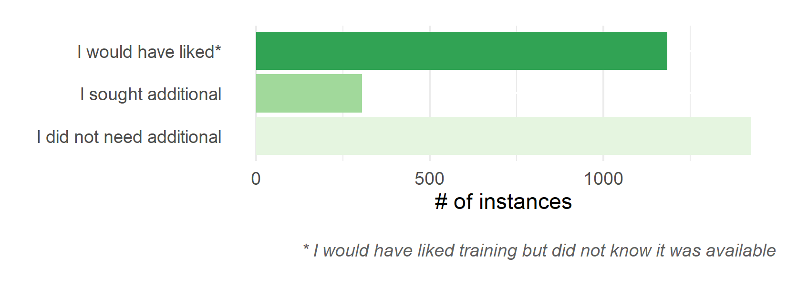

### Dispersion of Support and Training

Another notable finding is that of the respondents that sought training or support, there was no single portfolio or department that unanimously served a particular area, but rather, all 25 areas of DRI were served by several different units (Figures 6). Furthermore, for those that did seek both support and training, many turned to sources outside of UBC for a variety of DRI areas.   

**Figure 6**
 
 
 
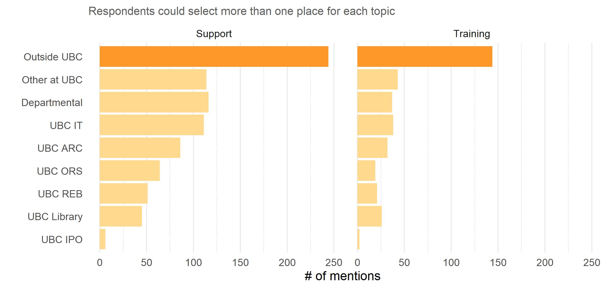

### Training Within UBC

A large number of respondents indicated that they sought training outside of UBC. However, a common theme in the focus groups was the desire for more training offered by UBC. A motivation for wanting internal training is that this encourages the growth of research communities and networks, for both faculty as well as graduate researchers. 

**Figure 7.  Focus Group Quotes Regarding Internal Training at UBC.**

> \"If [training] can occur here, you build up this kind of community of practice... and that support can help, and it gives people the opportunity to talk to others about what they\'re trying to [do and what] they're having trouble with.\"

> \"I always try to get [training] within UBC and be aligned with what you see [UBC] offering, because then it shows that I\'m trying to build the research network here and use the services and help them get better.\" 

> \"I can only see benefits in having training inside UBC.  Of course, you need to have the proper personnel to do that... but you know my first option will always look at UBC before looking outside, and I\'ll be very happy if I can find something.\"

> \"Empowering graduate students [to] seek out their own network and other graduate students within their institution is always really rewarding for everyone, [and] it usually leads to a lot of productivity.\"
 

### Regularly Offered/Asynchronus Training

In addition to localized training, focus group participants also indicated that having training offered regularly throughout the year would be beneficial, as graduate students arrive throughout the year. In this same line of discussion, participants indicated that asynchronous or online training would be of value, as it would not only accommodate those who cannot make live training sessions, but is a beneficial supplement to live training. 

**Figure 8.  Focus Group Quotes Regarding the Frequency of Training Offerings**  

> \"It\'s easy when students all come in September, because we seem to be geared up in that time on this campus to put people through [training]. But when they show up in May, they\'ve missed much [of the training offered], so I think options that are online [would be helpful].\"

> \"Training would probably be useful [if] regularly offered. And I recognize the landscape is changing all the time, but that\'s why it needs to be regularly offered.\"
  
> \"I think having some ability to do asynchronous learning would facilitate students coming at different times and being able to go at their own pace…[and then would build] the ability to come with targeted questions.\"

> \"I like the little canvas modules... I think those are useful. I always advocate for them as ways to do training. And those paired with... regular drop in [sessions] it seems to me, would be really useful.\"

> \"I think that tutorial packages with examples are by far the best way [for me to learn] ... But I know that other people do have different needs and I think that having direct feedback and being able to ask a human being questions is useful for some people.\"
 
 
### Research Data Management

The survey highlights three trends of interest for RDM support services[^6].  RDM as a support service has traditionally been embedded in the activities of academic libraries[^7], and this is reflected at UBC with UBC Library‘s involvement in national RDM initiatives as well as coordinating funding and training for dedicated research data repositories. Yet, only 16% of researchers who sought support for data retention/deposit/preservation and 24% of those seeking support for data management plans went to UBC Library (Figure 9). For data retention specifically, UBC ARC and UBC IT are the primary units offering support for issues related to data privacy, security, and deposit when traditional data repositories are not an option. However, 20% of respondents seeking support in these areas went outside of UBC.  

Data Management Plans are an integral component in adhering to funder mandates, and UBC--through UBC Library and UBC ARC--has invested time and resources in support of the development of the DMP Assistant to facilitate and streamline this task for researchers. Respondents turned to several different campus units for support, however, and almost one quarter (24%) sought this support outside of UBC (Figure 9). Together, this suggests several issues of concern. The first reflects the need to effectively direct researchers to the best point of contact for a particular service related to RDM. The second reflects that while the university and researcher each hold a degree of responsibility for ensuring the integrity of research data, many researchers are opting to work with non-UBC entities to address their RDM needs. Thirdly is that despite investment in solutions to address things like funder mandates that attempt to ensure that RDM is properly handled and administered, the products of these investments are not being used to their full potential by UBC’s research community.  

**Figure 9**
 
 
 
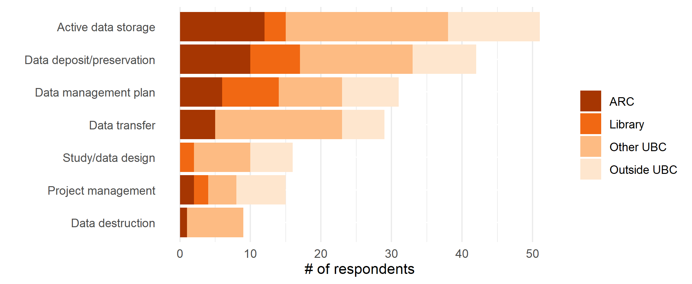

Similar trends in RDM support also emerged for RDM training.  30% or fewer of those seeking training in these fields looked to UBC Library and while UBC IT and UBC ARC were noted other locations where RDM training was sought, an equal, if not larger number of respondents indicated that they went outside of UBC (Figure 10).    

**Figure 10**
 
 
 
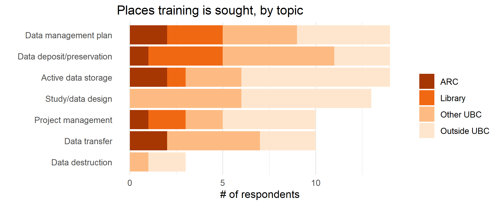

### Research Computation and Software

In today’s academic research environment, research computing, including but not limited to: data analysis, modeling, machine learning, and visualization, are fundamental aspects of research, innovation, and discovery.  The software, hardware, and human support to enable these activities across a breadth of disciplines and research tasks is a complex undertaking. While survey results highlight that these areas are growing rapidly, they lack a recognized home at UBC.  Of the researchers who sought additional training or support in “coding/programming” at UBC, only 15% of respondents went to UBC ARC for training and 7% for support (Figure 11 and 12).  These numbers were the highest percentage of a single unit sought within UBC, indicating that training and support are very dispersed across the institution and there is no clear unit serving the research community.  

**Figure 11**
 
 
 

**Figure 12**
 
 
 

Furthermore, there is an interesting disconnect within this category whereby the training units do not necessarily reflect the same department breakdown in support.  For example, respondents went to UBC ARC and UBC Library for “machine learning” training, but they did not go to these units for support.  While research support units may view training and support for these categories as intertwined services, these findings suggest that the research community may view them as very separate services. 

There is also evidence that the UBC community is not finding the support and training they research computation and software from the institution.  A significant number of respondents did not know training or support was available, though they would have liked to utilize it (Figure 13 and 14). 

**Figure 13**
 
 
 
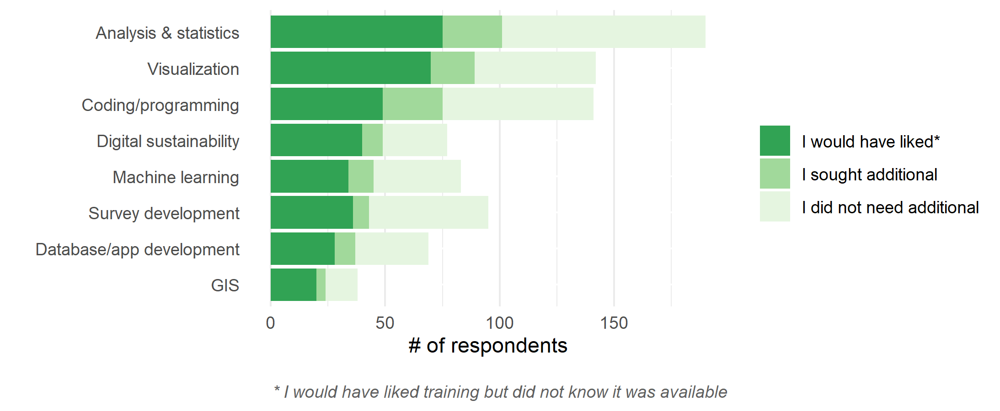

**Figure 14**
 
 
 
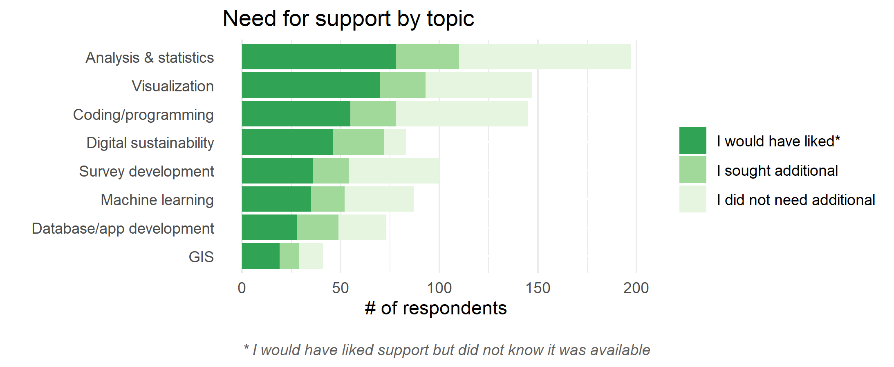

### Advanced Research Computing

As a partner in the needs assessment work, UBC ARC was able to solicit feedback from current researchers who leverage these services with 48% of respondents reporting high performance computing (HPC) and/or commercial cloud (“cloud”) as relevant to their research.   Additionally, respondents who indicated that they leverage HPC and/or cloud also indicated that other DRI areas were of relevance (Figure 15).  This is not surprising as HPC and cloud require sizable datasets and with that, data management, machine learning, data transfer, privacy and security, and all the other elements of the DRI spectrum.  The reversal is not necessarily true whereby a researcher who needs project management, privacy, or data destruction, for instance, may not need or know of HPC or cloud. This is notable for a department, such as UBC ARC, to recognize that the department will not be the only stop in the researcher’s need for training and support. 

**Figure 15**
 
 
 
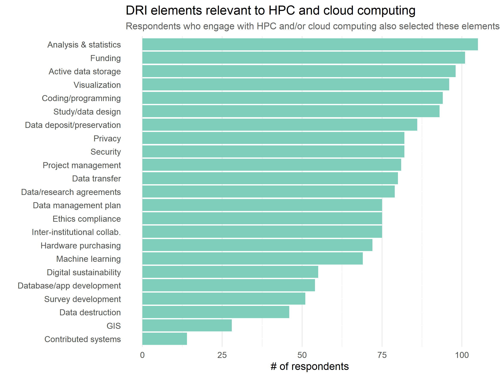

As was the case in prior sections, the most common place for training and support is “Outside of UBC”.  Within HPC and cloud, this may mean on-demand-training, training through Compute Canada, or the multiple other online resources that are free (e.g., YouTube, other university sites, etc.).  When discussing this with focus group participants, the overwhelming feedback is if the training and support can be through UBC, that would be preferrable (Figure 7). 

### Other Research Support

Though UBC Library and UBC ARC partnered on this needs assessment, the feedback provided by those surveyed was not limited to training and support offered only by those units. The university research landscape is complex and diverse with research intensive departments providing internal support, administrative departments ensuring compliance, finance and human resources supporting the business function, and affiliated hospitals supporting their own internal processes.   

This is not unique to UBC[^8]  University units and departments have struggled as to how to better support the research community knowing that academic research is competitive and research dollars can be an important investment stream.

### The Alliance DRI Needs Assessment

From February to March 2021, the Alliance conducted [The Canadian Digital Research Infrastructure Needs Assessment](https://alliancecan.ca/en/initiatives/canadian-digital-research-infrastructure-needs-assessment), receiving over 1380 responses from researchers across a variety of disciplines.  As part of the assessment, there was also a call for position papers to a broad range of stakeholders, which resulted in a total of 107 papers covering topics from data management, training, data governance, and others.  The similarity in findings of both the UBC and national needs assessments are notable, including the need for greater awareness of services, a need for training and support across a range of DRI elements, as well as there being multiple locations in which researchers seek DRI services.    

## Recommendations & Next Steps

### Overarching Recommendations

It is apparent that researchers are going outside of UBC too often for core DRI training and support.  Focus group feedback, supported by data on overall satisfaction, shows this is not due to the fact that they did not want to utilize UBC based services; focus group participants said that they would advocate the use of UBC training and support over those from outside of the university.  Considering this, and the other highlighted findings from the survey, the following recommendations can be made: 

**Recommendation 1:** Develop a unified research data web portal and governance structure to connect all services and departments across the institution that serve DRI, to provide a single point of entry to DRI at UBC. 
 
 
**Recommendation 2:** Establish a unified communication strategy across these service providers that is cohesive and focuses on researchers. 
 
 
**Recommendation 3:** Implement a unified cross-campus training and support strategy that leverages the roles and expertise of various campus partners, and that is inclusive of and sensitive to the staffing, resources, and unique contexts of each UBC campus. 

### Next Steps

**_Recommendation 1: Develop a unified research data web portal and governance structure_**

DRI resources are managed and coordinated by a number of units and departments across UBC and distributed among its campuses. RDM is a key element of all DRI activities and mirrors this distribution. Key findings from this survey under the header Research Data Management suggest that this distribution of supports is problematic when it comes to researchers identifying where to ask for support and training. At the same time, this distribution risks the creation of silos and subsequent misinformation among those units that provide RDM support and training. These issues have been highlighted in a number of recent data collection efforts at UBC, including the Research Data Management Strategy Project and Steering Committee town halls and preliminary work by staff from the Office of Research Ethics (ORS), UBC ARC, and UBC Library to document the breadth of RDM supports communicated through department and unit web pages. 

A unified RDM web portal offers an opportunity for a single URL to direct and connect researchers with the content experts and service providers across the range of RDM services supported by UBC. It also offers a single point of entry for service providers to communicate how their supports are connected with other campus units and to ensure that information and contacts are up to date and informed by those with a primary responsibility for specific aspects of RDM support and training. 

Work related to a unified portal has been under development since late 2020, and a draft proposal of the scope of activities can be access here.

**_Recommendation 2: Establish a unified communication strategy_**

Survey results indicate that in addition to needing to direct users to the most appropriate service expert, UBC DRI supports and training activities lack engagement with the research community as indicated by a significant number of respondents not being aware of available supports, services, and training. Communications have a lot of competition on relatively narrow bandwidths. Each unit, with narrowly focused outreach has limited reach. A collective communication strategy that leverages these respective channels and makes an effort to direct communications to where researchers are accessing their feeds, not where they will find our feeds, would help to lessen the burden of discovery on researchers and increase the impact of existing resource expenditure by UBC on DRI supports and training. 

Research projects are complex. In a clinical context for example--and at a high level--this might involve drafting a proposal, developing a data management plan, getting security and privacy reviews, clearing clinical ethics and biosafety certification, interfacing with multiple human resources and finance departments, etc.  Details then include discrete protocols related to consent, privacy, security, data de-identification, data access requests, data storage, HPC for data analysis, long-term data sharing and retention etc. While ethics, HR, and finance are generally known entities with required templates to facilitate navigation, units that support DRI services--RDM, HPC, cloud, data transfer, machine learning etc--are not currently required access points at UBC. 

Finding assistance in DRI training and support needs to be easy and appropriately directed. This requires effective communication, and using traditional services to advertise resources as well as administrative and departmental channels to funnel researchers at the point of need to localized services when available.  Researchers will source information that is convenient, if it is not communicated that these services are within the campus, they will not be used. A communication strategy across departments supporting DRI, while a significant undertaking, would be of immense value. A smaller-scale approach might start with departments and units coordinating cross-support communications. The location of the information is of less concern than its replication across multiple platforms and systems of dissemination--a UBC Library webpage, a UBC ARC webpage, a graduate studies forum etc. 

**_Recommendation 3: Implement a unified cross-campus training and support strategy_**

Directing researchers to the sources of support and training for DRI is the first step. Support and training must address the needs of researchers where they are to be of value. Support and training should also reflect the expertise of the various units involved in supporting DRI related activities. 

Currently DRI related training opportunities are developed independently by a number of different departments and units. This creates redundancies, confusion about where to go to seek training, and limits scaffolding of learning content and effective hand-off between campus units for further training and support. There is limited reason for multiple groups at UBC to offer the same course, yet that is often found across these different units.  If there are two or more campus units providing “Introduction to Unix Shell” there should be a purpose for this. If UBC Library runs a workshop on metadata, this would benefit from being discretely connected to a UBC ARC workshop on metadata in the context of HPC. 

Additionally, different disciplines have different learning needs and prior exposure to computational methods, RDM, and the hardware and software that support these. While they may be utilizing the same DRI infrastructure, their usage of systems and software may differ greatly. Consequently, a learning strategy that is scaffolded and connected between both support and disciplinary units should be coordinated with this in mind.  

It is also worth noting when thinking about the benefits of a unified strategy where the strengths of various units lie; UBC Library has a strong history of developing content for information literacies, in a computational environment, UBC ARC provides the computational infrastructure in which these literacies are used to conduct research, and specific departments provide the subject expertise to translate literacies and infrastructure into meaningful research. A scaffolded, targeted and unified training and support strategy would build on this. 

Lastly, each unit should look at their current training and support offerings with a critical eye.  What the data reflects is that those who utilized the training and support from UBC units were for the most part satisfied or very satisfied.  However, what is not clear is whether those searching for these supports did not find the match on the newsletters, webpages, etc. If the researcher is wanting training in HPC and bioinformatics, even for introductory information, they may prefer a course that is aimed at that audience over a generic introductory course[^9].  This type of evaluation needs to be done no matter the collaboration or communication that could happen.  It is important that the training is refreshed and based on current needs, not what has already been taught.      

## Detailed graphs

**Figure 16**
 
 
 
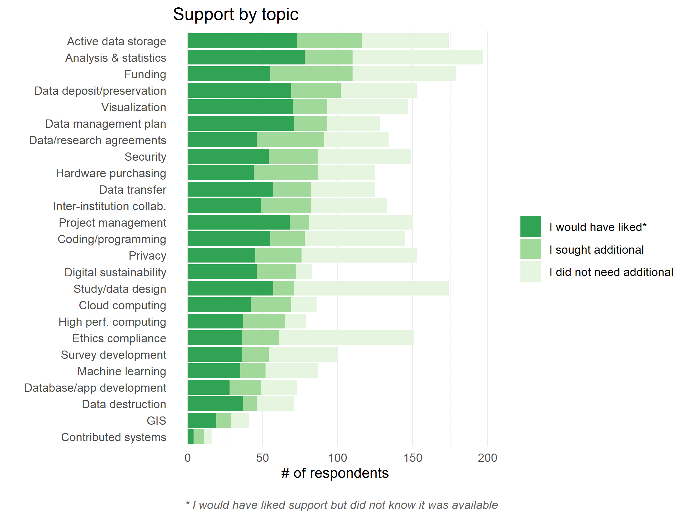

**Figure 17**
 
 
 
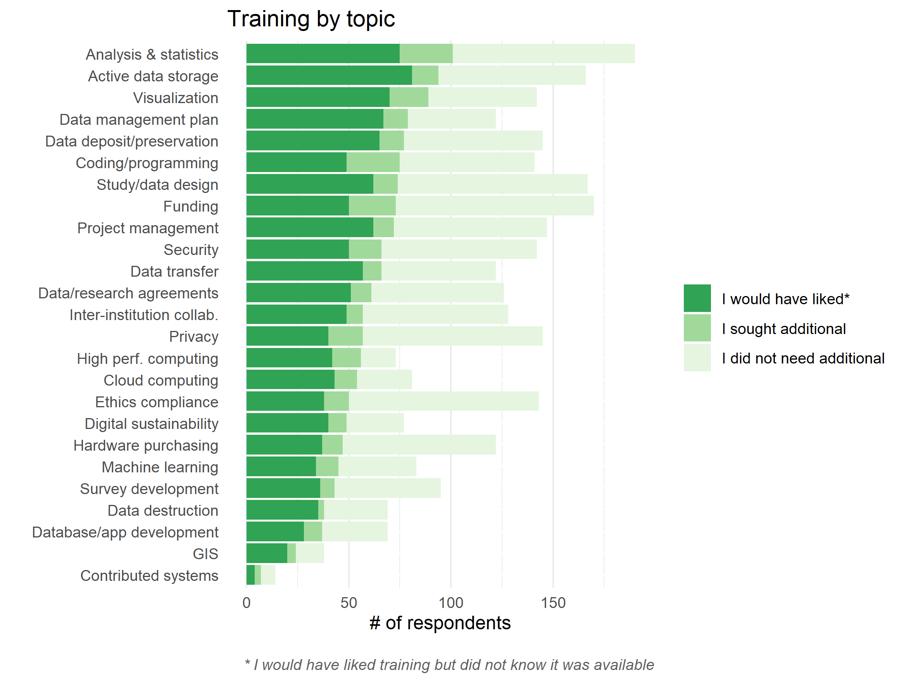

## References

[^1]: University of Central Florida Libraries, “Overview: Research Lifecycle,” *University of Central Florida Libraries*, n.d., [https://library.ucf.edu/about/departments/scholarly-communication/overview-research-lifecycle/](https://library.ucf.edu/about/departments/scholarly-communication/overview-research-lifecycle/)

[^2]: Digital Research Alliance of Canada, “Strategic Plan 2022-2025,” Digital Research Alliance of Canada, n.d., [https://stratplan.alliancecan.ca/en/](https://stratplan.alliancecan.ca/en/)

[^3]: Ryan Smith, “How Technology is Changing Academic Research,” *Wired*, July 2013, [https://www.wired.com/insights/2013/07/how-technology-is-changing-academic-research/](https://www.wired.com/insights/2013/07/how-technology-is-changing-academic-research/ )

[^4]: UBC Advanced Research Computing, “Enhancing Support for Advanced Research Computing,” *UBC Advanced Research Computing*, n.d., [https://arc.ubc.ca/enhancing-support-advanced-research-computing](https://arc.ubc.ca/enhancing-support-advanced-research-computing)

[^5]: Digital Research Alliance of Canada, “The Alliance,” *Digital Research Alliance of Canada*, n.d., [https://alliancecan.ca/en/about/alliance](https://alliancecan.ca/en/about/alliance)

[^6]: John Cox, “Positioning the Academic Library within the Institution: A Literature Review,” _New Review of Academic Librarianship_ 24, 3-4 (2018), [doi.org/10.1080/13614533.2018.1466342](doi.org/10.1080/13614533.2018.1466342)

[^8]: Kristin A. Briney, “Data Management Practices in Academic Library Learning Analytics: A Critical Review,” _Journal of Librarianship and Scholarly Communications_ 7, no. 1 (February 2019), [https://doi.org/10.7710/2162-3309.2268](https://doi.org/10.7710/2162-3309.2268)

[^8]: University of Central Floriday Libraries, “Research Lifecycle at University of Central FL,” *University of Central Floriday Libraries* n.d., [https://library.ucf.edu/wp-content/uploads/sites/5/2017/06/research-life-cycle.png](https://library.ucf.edu/wp-content/uploads/sites/5/2017/06/research-life-cycle.png)

[^9]: Phillip A. Richmond and Wyeth W. Wassermann, “Introduction to Genomic Analysis Workshop: A catalyst for engaging life-science researchers in high throughput analysis,” _F1000 Research_, (July 2019), https://doi.org/10.12688/f1000research.19320.1  

