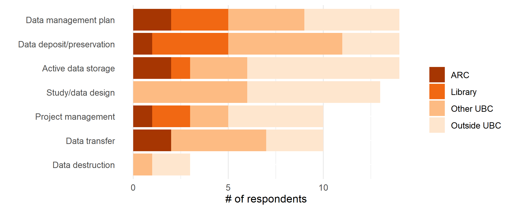
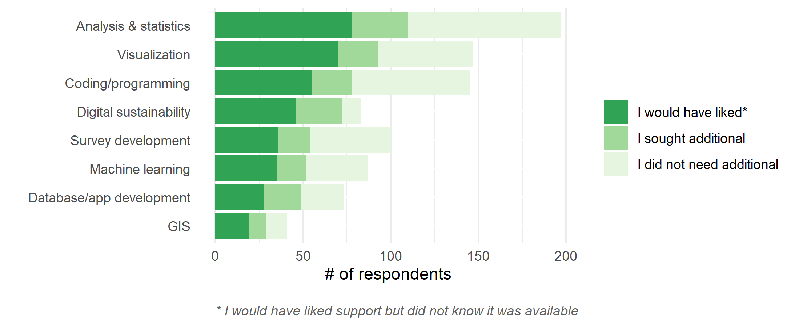

<h2>Table of Contents</h2>

* [Introduction](#introduction) 
* [Background](#background)
* [Methodology](#methodology) 
* [Results](#results)
* [Recommendations & Next Steps](#recommendations--next-steps)
* [Detailed Graphs](#detailed-graphs)
* [References](#references)

<a href="#top" class="back-to-top-link">🔝</a>

## Introduction   

Within the academic research environment there is an ever-increasing need for substantive digital research infrastructure (DRI), at both the national and institutional levels.  DRI refers to a suite of services that enables the collection, processing, dissemination, and disposition of research data. In practice this is the software, code, large-scale computational facilities, and data storage facilities required in the research data lifecycle [^1].  While academic researchers have historically compiled, analyzed, and temporarily stored data, the growth in the technology and capacity to obtain large data sets, and the requirements to share data indefinitely, have radically changed the needs for services, support, and training for the research community. 

The University of British Columbia (UBC) has invested significantly in DRI, with over $26 million a year in operating expenses for research excellence, which includes DRI, in order to promote and enhance these services across both Vancouver and Okanagan campuses as well as affiliated research institutes and hospitals. Two units that are fundamental in providing these services are UBC Advanced Research Computing (UBC ARC) and UBC Library. UBC ARC and UBC Library partnered in 2021 to assess current training and support services offered across several elements of DRI at UBC through a needs assessment survey and follow-up focus groups. This DRI Needs Assessment [“Needs Assessment”] was a substantive review of current DRI training and support utilized by UBC researchers. 

This report provides a summary of the findings and recommendations to address identified gaps and recommend strategies to improve utilization of the UBC DRI investment. 

## Background 

Disciplines that are not traditionally users of computational tools are increasingly relying on digital methodologies, platforms, and approaches. Meanwhile, disciplines that have integrated compute into their research workflow have a growing need for greater computation and data management support due to substantive datasets.  With this increasing demand, there is a need for universities to provide increased infrastructure and support.   

Research intensive universities must invest in computing facilities, data management, storage, software, and highly qualified personnel to support this infrastructure [^2] to be competitive. This need is as much predicated on providing the necessary frameworks to enable research as it is to entice top tier researchers; prospective faculty increasingly inquire about this kind of investment, and more universities are offering cloud credits and support as ways to entice candidates.  

Access to and support with growing amounts of data is central to enabling today’s research. “In the academic world, faculty understand this better than anyone because their careers hinge on publishing research in scholarly journals. Standing between every researcher and peer-reviewed publication, however, are mountains of messy logistics that must be removed to focus on what really matters: first-rate research design and analysis” [^3]. 

UBC has recognized this is an area where financial and resource investment is required.  Substantive contributions have been made to advanced research compute infrastructure, including hiring new positions in UBC ARC and UBC Library to support research data management (RDM), data, and digital scholarship across a range of disciplines.  While UBC ARC and UBC Library have positioned themselves to lead the provisioning of services and support related to DRI, this work is contributed to in significant ways by several departments and faculty specific resources on both campuses, often working in isolation from one another. 

### UBC ARC  

UBC ARC was formally launched in 2015. However, the infrastructure it maintains and provides to researchers is relatively new.  In 2019, UBC ARC Sockeye (“Sockeye”), a 15,872 CPU and 200 GPU high performance computing (HPC) system available to UBC researchers was launched as a complement to the national computing services.  In 2020, UBC ARC Chinook (“Chinook”), a 20 petabyte object storage platform was subsequently launched.  Combined, Sockeye and Chinook were enabled through capital investments totaling over C$18 million [^4].  Often, ARC services are provided through a traditional IT department, with staff having various levels of research experience.  In contrast, UBC ARC is a multidisciplinary unit within the Office of the Vice President of Research and Innovation, comprised of staff members in traditional ARC roles such as system administrators, and former researchers, as well as less traditional members with backgrounds in areas such as health, oceanography, archeology, and library and information sciences.  

UBC ARC occupies a unique position at the intersection of HPC, RDM, and research software (RS), and leverages this position through collaboration with departments and portfolios spanning UBC to offer support and training across the range of DRI activities queried in this Needs Assessment.  Over the course of the last two years, UBC ARC staff have hosted a number of introductory courses on HPC, commercial cloud, and RDM. 

### UBC Library 

As research outputs have grown to include not just journal articles and monographs, the role of the academic library is shifting. One direction of this shift is the need to tackle and embrace managing digital research objects.  UBC Library is well poised to do this by virtue of (1) the development of and access to collections, including non-traditional platform acquisitions, and (2) training in information literacies.  Like many institutions, UBC Library started hiring and cultivating expertise to address these new roles.  In 2014, a Research Data Management position was created.  Following this, DRI related activities were built directly into several positions that contribute to the campus community by developing digital research infrastructure resources for faculty, staff, and students.  

UBC Library offers regular foundational workshops and provides access to several research data repositories, including UBC Dataverse, Federated Research Data Repository (FRDR), and Dryad. In addition, the Library invests in the development of institutional and national platforms that enable the operationalization of RDM mandates such as the DMP Assistant. 

On the Vancouver campus, DRI activities such as RDM, tools for data visualization, statistical analysis, geospatial inquiries, and text analysis are supported by the Research Commons. On the Okanagan campus, the Centre for Scholarly Communication (CSC), launched in 2020, brings together expertise from the Library, Research Computing, and the Office of Research Services in a single portal to facilitate researcher access to training and support across the full scope of DRI activities queried in the Needs Assessment. 

### Campus Context 

Within the UBC context, the Vancouver and Okanagan campuses are often evaluated separately as the courses, faculty, staff, and student make-up is different. Because of this, it is worth noting that the support services and training infrastructures vary between the two campuses and may have impacted responses to the Needs Assessment survey. 

### National DRI  

Similar to UBC’s siloed nature of DRI support, at a national level, DRI has been supported by three organizations responsible for ARC, RDM, and RS, operating as separate services. Approaches to building competency and capacity in these areas lacked coordination. In an effort to address this, the federal government provided C$375 million in funding to consolidate these organizations; the subsequent launch of the Digital Research Alliance of Canada (“The Alliance”) represents a momentous integration of these three components of DRI nationally [^5].    

Concurrent to this Needs Assessment of UBC researchers, the Alliance conducted a similar survey at the national level, which will be discussed further in this report.  

## Methodology  

Data collection for the Needs Assessment consisted of (1) a survey assessing current usage, awareness, and gaps in research data, software, and computational training and support, and (2) three follow-up focus groups guided by questions informed by survey results.  

### Data Availability 

Survey responses were collected anonymously, except where participants could enter an email address to enter a draw or participate in focus groups. Any identifying data points from both the survey, including emails, geolocation, and survey dissemination channel, and focus groups were removed before analysis. The survey, survey data, and focus group materials are available <a href="https://doi.org/10.5683/SP3/YIIYOX" target="_blank">here</a>.

### Survey 

The Needs Assessment survey was open from May 17 - June 12, 2021, and queried UBC researchers’ training and support needs in 25 distinct areas relating to data, software, and computational infrastructure (Table 1). Open to all UBC researchers, the survey was distributed online through UBC Library and UBC ARC communication channels, university-wide newsletters, and targeted groups known to use at least a subset of these services. A total of 241 responses were received. 

For the purpose of the survey, training and support were looked at as distinct services, with “training” defined as "single workshops, workshop series, online modules/videos, and formal courses", and “support” defined as "web resources, consultations, advising, troubleshooting, and recommendations".  
After entering demographic information, participants were presented with a list of 25 areas of DRI, and asked to select all those relevant to their research. Following, each participant was asked to complete questions for each DRI element selected, including (1) whether they needed or wanted training/support, (2) if they sought training/support, and if so, (3) where they went and how satisfied they were with the training/support received. Participants were also given the option to submit free-text comments at the end of the survey.  For analysis, the 25 DRI elements were categorized into four groups, loosely based on their relationships with one another (Table 1).  

**Table 1: 25 DRI tools and services presented by group in Needs Assessment survey**
 
 
 

### Focus Groups 

As part of the survey, participants were asked if they would be willing to participate in a focus group. Of the 23 respondents who provided contact information, 11 participated in three focus groups.  Focus groups were semi-structured, containing scripted questions but also allowing discussion. For each session, two members from the Needs Assessment working group were present, with one person leading the discussion and the other taking notes. Sessions were conducted via Zoom, and recorded as well as transcribed using Zoom's built-in software. Recordings were deleted after transcripts were exported to a secure storage platform and all transcripts were stripped of identifiers. While transcripts were not formally coded or analyzed, relevant excerpts were extracted. 

### Limitations  

The Needs Assessment was designed to evaluate awareness of and need for support and training in DRI. The survey focused on whether training and support was sought or needed. While free text fields allowed for respondents to provide additional qualitative feedback, the survey did not otherwise capture why or at what level these training and supports were needed. While the focus groups allowed a deeper dive into these issues, the pool of focus group participants represents a sample biased by size, discipline, volunteer bias, and scheduling parameters. Further inquiry would be required to enhance our understanding of specific training and support needs, modalities of delivery, and access points to increase awareness.  

## Results  

The following results present key findings from the Needs Assessment survey and focus groups. While the overall findings suggest gaps in training and support across institutional support units, the findings presented here focus on services, training and support offered by UBC ARC and UBC Library.  

### Demographics  

The survey collected demographic information about participants' position at UBC, their discipline, and their primary work location. Professors made up the largest group of respondents (Figure 1). In terms of research discipline, Medicine and Health Sciences, as well as the Social Sciences and Humanities made up a disproportionate number of respondents (Figure 2). The primary work location of the majority of respondents was the Vancouver campus (Figure 3). However, when normalized to 2020 data for total number of graduate students and faculty, and grouping affiliated institutions with the UBC Vancouver campus, UBC Vancouver had a response rate of 1.3% and UBC Okanagan a response rate of 3.5%. 

The “Other (please specify)” responses included research staff such as research assistants, coordinators, and information technology (IT) support. 

**Figure 1. Survey responses by position**
 
 
 

**Figure 2. Survey responses by research discipline**
 
 
 

**Figure 3. Survey responses by primary work location**
 
 
 

### Awareness of Training and Support

There was a large discrepancy between the number of respondents that would have liked training or support but did not know it was available and those that sought support (Figures 4 and 5).  The gap between those that sought training or support versus those that wanted it is consistent across all 25 DRI elements and departments that serve these areas. This suggests that the issue of awareness is systemic and not discipline specific or unique to a single aspect of DRI.

**Figure 4. Total instances of “need for” and “awareness of” support selected**
 
 
 

**Figure 5. Total instances “need for” and “awareness of” training selected**
 
 
 

### Dispersion of Training and Support

Another notable finding is that of the respondents that sought training or support, there was no single portfolio or department that unanimously served a particular area, but rather, all 25 areas of DRI were served by several different units (Figure 6). Further, for those that did seek both support and training, many turned to sources outside of UBC for a variety of DRI areas.    

**Figure 6. Places support and training are sought broken down by department/location**
 
 
 

### Training Within UBC

A large number of respondents indicated that they sought training outside of UBC. However, a common theme in the focus groups was the desire for more training to be offered by UBC. A motivation for wanting internal training is that it encourages the growth of research communities and networks, for both faculty as well as graduate researchers.

**Focus Group Quotes Regarding Internal Training at UBC**

> \"If [training] can occur here, you build up this kind of community of practice... and that support can help, and it gives people the opportunity to talk to others about what they\'re trying to [do and what] they're having trouble with.\"

> \"I always try to get [training] within UBC and be aligned with what you see [UBC] offering, because then it shows that I\'m trying to build the research network here and use the services and help them get better.\" 

> \"I can only see benefits in having training inside UBC.  Of course, you need to have the proper personnel to do that... but you know my first option will always look at UBC before looking outside, and I\'ll be very happy if I can find something.\"

> \"Empowering graduate students [to] seek out their own network and other graduate students within their institution is always really rewarding for everyone, [and] it usually leads to a lot of productivity.\"
 

### Regularly Offered/Asynchronous Training

In addition to localized training, focus group participants also indicated that having training offered regularly throughout the year would be beneficial, due to the transient nature of faculty and students. Similarly, participants indicated that asynchronous or online training would be of value, as it would not only accommodate those who cannot make live training sessions, but is a beneficial supplement to live training.  

**Focus Group Quotes Regarding the Frequency of Training Offerings**

> \"It\'s easy when students all come in September, because we seem to be geared up in that time on this campus to put people through [training]. But when they show up in May, they\'ve missed much [of the training offered], so I think options that are online [would be helpful].\"

> \"Training would probably be useful [if] regularly offered. And I recognize the landscape is changing all the time, but that\'s why it needs to be regularly offered.\"
  
> \"I think having some ability to do asynchronous learning would facilitate students coming at different times and being able to go at their own pace…[and then would build] the ability to come with targeted questions.\"

> \"I like the little canvas modules... I think those are useful. I always advocate for them as ways to do training. And those paired with... regular drop in [sessions] it seems to me, would be really useful.\"

> \"I think that tutorial packages with examples are by far the best way [for me to learn] ... But I know that other people do have different needs and I think that having direct feedback and being able to ask a human being questions is useful for some people.\"
 

### Research Data Management  

RDM as a support service has traditionally been embedded in the activities of academic libraries [^6].  This is reflected at UBC with UBC Library‘s involvement in national RDM initiatives as well as coordinating funding and training for dedicated research data repositories. Yet, 24% of those seeking support for data management plans (DMPs) and only 16% of researchers who sought support for data retention, deposit, or preservation went to UBC Library (Figure 7). For sensitive data retention, UBC ARC and UBC IT are the primary units offering support for deposit when traditional data repositories are not an option. However, 20% of respondents seeking support in these areas still went outside of UBC.

Data management plans are an integral component in adhering to funder mandates, and UBC has invested significant time and resources in support of the development of the DMP Assistant to facilitate and streamline this task for researchers. Respondents turned to several different campus units for support, however 24% of respondents sought this support outside of UBC (Figure 7). This suggests several areas of concern. While the university and researcher each hold a degree of responsibility for ensuring the integrity of research data, many researchers are opting to work with non-UBC entities to address their RDM needs. There is a need to effectively direct researchers to the best point of contact for a particular service related to RDM within UBC. Despite investment in solutions to address things like funder mandates that attempt to ensure that RDM is properly handled and administered, the products of these investments are not being used to their full potential by UBC’s research community.   

**Figure 7. Places respondents sought support for RDM topics**
 
 
 

Similar trends in RDM support also emerged for RDM training.  Fewer than 30% of respondents seeking training in these fields looked to UBC Library, and while UBC IT and UBC ARC were noted as other locations where RDM training was sought, a larger number of respondents indicated that they went outside of UBC (Figure 8).

**Figure 8. Places respondents sought training for RDM topics**
 
 
 

### Research Computation and Software

In today’s academic research environment, research computing, including data analysis, modeling, machine learning, and visualization, are fundamental aspects of research, innovation, and discovery.  The support required to enable these activities across a breadth of disciplines and research tasks is a complex undertaking. While survey results highlight that these areas are growing rapidly, they lack a recognized home at UBC.  Of the researchers who sought additional training or support in “coding/programming” at UBC, only 15% of respondents went to UBC ARC for training and 7% for support (Figures 9 and 10).  These numbers were the highest percentage of a single unit sought within UBC, indicating that training and support are dispersed across the institution and there is no clear unit serving the research community.

**Figure 9. Places respondents sought support for research computing and software**
 
 
 

**Figure 10. Places respondents sought training for research computing and software**
 
 
 

Furthermore, there is a disconnect within this category in which the training units do not necessarily reflect the same department breakdown in support.  For example, respondents went to UBC ARC and UBC Library for “machine learning” training, but they did not go to these units for support.  While research support units may view training and support for these categories as intertwined services, these findings suggest that the research community may view them as separate services.

There is also evidence that the UBC community is not finding the research computation and software  support and training they need from the institution.  A significant number of respondents did not know training or support was available, though they would have liked to utilize it had they known it was (Figures 11 and 12).

**Figure 11. Respondents’ needs for support in research computing and software**
 
 
 

**Figure 12. Respondents’ needs for training in research computing and software**
 
 
 

### Advanced Research Computing

UBC ARC was able to solicit feedback from current researchers who leverage these services with 116 respondents (48%) reporting HPC and/or commercial cloud (“cloud”) as relevant to their research.   Additionally, respondents who indicated that they leverage HPC and/or cloud also indicated that a significant number of the 25 DRI areas surveyed were relevant to their research (Figure 13).  This is not surprising as HPC and cloud research often involve sizable datasets requiring other elements of the DRI spectrum, including data management, machine learning, data transfer, privacy and security.  The reversal is not necessarily true whereby a researcher who needs project management, privacy, or data destruction, for instance, may not need HPC or cloud. It is therefore important to recognize that a department such as UBC ARC will not be the only stop in the researcher’s need for training and support.

**Figure 13. Additional DRI elements relevant to researchers using HPC and cloud**
 
 
 

Consistent with other findings, the most common place for HPC and cloud training and support is “[o]utside of UBC”.  This may mean on-demand-training, training through Compute Canada/Alliance, or the multiple other online resources (e.g., YouTube, other university sites, etc.).  When discussing this with focus group participants, the overwhelming feedback is training and support through UBC, is preferred.

### Other Research Support

Though UBC Library and UBC ARC partnered on this Needs Assessment, the feedback provided by those surveyed was not limited to training and support offered only by those two units. The university research landscape is complex and diverse with research intensive departments providing internal support, administrative departments ensuring compliance, finance and human resources supporting the business function, and affiliated hospitals supporting their own internal processes.

This complex administrative support system is not unique to UBC and is something universities recognize they need to improve.  Not only is this important for research workflow efficiency, but is also vital for universities, as academic research is competitive and research dollars are important to reputation [^7].  

### The Alliance DRI Needs Assessment

From February to March 2021, the Alliance conducted [The Canadian Digital Research Infrastructure Needs Assessment](https://alliancecan.ca/en/initiatives/canadian-digital-research-infrastructure-needs-assessment), receiving over 1,380 responses from researchers across a variety of disciplines.  As part of the assessment, there was also a call for position papers to a broad range of stakeholders, which resulted in a total of 107 papers covering topics from data management, training, data governance, and others.  The findings are similar across the UBC and national needs assessments, including the need for greater awareness of services, a need for training and support across a range of DRI elements, as well as there being multiple locations in which researchers seek DRI services.

## Recommendations & Next Steps

### Overarching Recommendations

**Recommendation 1:** Develop a unified research data web portal and governance structure to connect all services and departments across the institution that serve DRI, to provide a single point of entry to DRI at UBC.
 
 
**Recommendation 2:** Establish a unified communication strategy across these service providers that is cohesive and focuses on researchers. 
 
 
**Recommendation 3:** Implement a unified cross-campus training and support strategy that leverages the roles and expertise of various campus partners, and that is inclusive of and sensitive to the staffing, resources, and unique contexts of each UBC campus.
 
### Next Steps  

**_Recommendation 1: Develop a unified research data web portal and governance structure_**

DRI resources are managed and coordinated by a number of units and departments across UBC and distributed among its campuses. RDM is a key element of all DRI activities and mirrors this distribution. Key RDM findings suggest that this distribution of support is problematic when it comes to researchers identifying where to ask for support and training. At the same time, this distribution risks the further expansion of silos and subsequent misinformation among those units that provide RDM support and training. These issues have been highlighted in a number of recent data collection efforts at UBC, including the Research Data Management Strategy Project and Steering Committee town halls and preliminary work by staff from the Office of Research Ethics (ORS), UBC ARC, and UBC Library to document the breadth of RDM supports communicated through department and unit web pages.

A unified RDM web portal offers an opportunity for a single URL to direct and connect researchers with the content experts and service providers across the range of RDM services supported by UBC. It also offers a single point of entry for service providers to communicate how their supports are connected with other campus units and to ensure that information and contacts are up to date and informed by those with a primary responsibility for specific aspects of RDM support and training.

Work related to a unified portal has been under development since late 2020, and a draft proposal of the scope of activities can be accessed at the following links:

* <a href="https://ubcca.sharepoint.com/:w:/t/ubcAVRC-gr-RDMEthics/EakJR_JFED9DqZb4i92RxysBMbBzQa8NCoUJpUv7Tqc8Rg?e=sQvGGz" target="_blank">Link to Web Portal Proposal</a>
* <a href="https://ubcca.sharepoint.com/:w:/t/ubcAVRC-gr-RDMEthics/EVDRUi9wybFPnKF57syHioYByr1UHV6FYo2H6uO9N_4JTQ?e=W4uYvS" target="_blank">Link to Web Portal Team Terms of Reference</a>

**_Recommendation 2: Establish a unified communication strategy_**

Survey results indicate that in addition to the need to direct users to the most appropriate service expert(s), UBC DRI support and training activities lack effective communications with the research community. Communications have a lot of competition on relatively narrow bandwidths. Many institutional support units have limited reach due to narrowly focused outreach.  A unified communication strategy would ensure that there is a coordinated message to researchers and a reduction in information overload. 

Research projects are complex. In a clinical context for example, this might involve drafting a proposal, developing a data management plan, security and privacy reviews, clinical ethics approval and biosafety certification, and interfacing with multiple human resources and finance departments. Subsequent steps may then involve data de-identification, data access requests, storage, HPC for analysis, long-term data sharing and retention. While ethics, HR, and finance are generally known entities with required templates to facilitate navigation, units that support DRI services such as RDM, HPC, cloud, data transfer, and machine learning are not currently required access points at UBC.

Finding assistance in DRI training and support must be easy and appropriately directed. Researchers will source information that is convenient, if it is not communicated that these services are within the campus, they will not be used. A communication strategy across departments supporting DRI, while a significant undertaking, is of immense value. A smaller-scale approach should start with departments and units coordinating cross-support communications.
 
**_Recommendation 3: Implement a unified cross-campus training and support strategy_**

Directing researchers to the sources of support and training for DRI is the first step. Support and training must address the needs of researchers to be of value. Support and training should also reflect the expertise of the various units involved in supporting DRI related activities.  

Currently, DRI related training opportunities are developed independently within a number of different departments and units. This creates redundancies, confusion about where to seek training, and limits scaffolding of learning content and effective hand-off between campus units for further training and support. There is limited reason for multiple groups at UBC to offer the same course, yet that is often found across these different units.  If, for example, two or more campus units provide “Introduction to Unix Shell” there should be a purpose for this, beyond the need to meet key performance indicators (KPIs). Additionally, if UBC Library runs a workshop on metadata, it would benefit from being discretely connected to a UBC ARC workshop on metadata in the context of HPC.  

Different disciplines have different learning needs and exposure to computational methods, RDM, and the hardware and software supporting their research. While they may be utilizing the same DRI infrastructure, their usage of systems and software may differ greatly. Consequently, a learning strategy that is scaffolded and connected between both support and disciplinary units must be coordinated with this in mind.   

It is also worth considering the benefits of a unified strategy given the strengths of various units. UBC Library has a strong history of developing content for information literacies, and in a computational environment, UBC ARC provides the infrastructure in which these literacies are used to conduct research. Specific departments may provide the subject expertise to translate literacies and infrastructure into meaningful research. A scaffolded, targeted and unified training and support strategy would build on this. Any approach would also benefit from each unit reviewing their current training and support initiatives in light of this and the Alliance survey findings, ensuring content is appropriately targeted to the requisite skill levels and domain knowledge of UBC researchers. 

## Detailed graphs

**Figure 14. Total responses for "need for support" by DRI Element**
 
 
 

**Figure 15. Total responses for "need for training" by DRI Element**
 
 
 

## References

[^1]: University of Central Florida Libraries, “Overview: Research Lifecycle,” *University of Central Florida Libraries*, n.d., <a href="https://library.ucf.edu/about/departments/scholarly-communication/overview-research-lifecycle/" target="_blank">https://library.ucf.edu/about/departments/scholarly-communication/overview-research-lifecycle/</a>

[^2]: Digital Research Alliance of Canada, “Strategic Plan 2022-2025,” Digital Research Alliance of Canada, n.d., <a href="https://stratplan.alliancecan.ca/en/" target="_blank">https://stratplan.alliancecan.ca/en/</a>

[^3]: Ryan Smith, “How Technology is Changing Academic Research,” *Wired*, July 2013, <a href="https://www.wired.com/insights/2013/07/how-technology-is-changing-academic-research/" target="_blank">https://www.wired.com/insights/2013/07/how-technology-is-changing-academic-research/</a>

[^4]: UBC Advanced Research Computing, “Enhancing Support for Advanced Research Computing,” *UBC Advanced Research Computing*, n.d., <a href="https://arc.ubc.ca/enhancing-support-advanced-research-computing" target="_blank">https://arc.ubc.ca/enhancing-support-advanced-research-computing</a>

[^5]: Digital Research Alliance of Canada, “The Alliance,” *Digital Research Alliance of Canada*, n.d., <a href="https://alliancecan.ca/en/about/alliance" target="_blank">https://alliancecan.ca/en/about/alliance</a>

[^6]: Kristin A. Briney, “Data Management Practices in Academic Library Learning Analytics: A Critical Review,” _Journal of Librarianship and Scholarly Communications_ 7, no. 1 (February 2019), <a href="https://doi.org/10.7710/2162-3309.2268" target="_blank">https://doi.org/10.7710/2162-3309.2268</a>

[^7]: HeinOnline U.S. Congressional Documents Library. Research funding as an investment--can we measure the returns?, (Washington: 1986), Retrieved from 
<a href="https://www.princeton.edu/~ota/disk2/1986/8622/8622.PDF  " target="_blank">https://www.princeton.edu/~ota/disk2/1986/8622/8622.PDF  </a>

