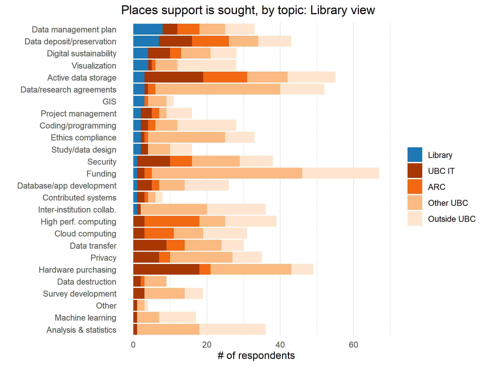
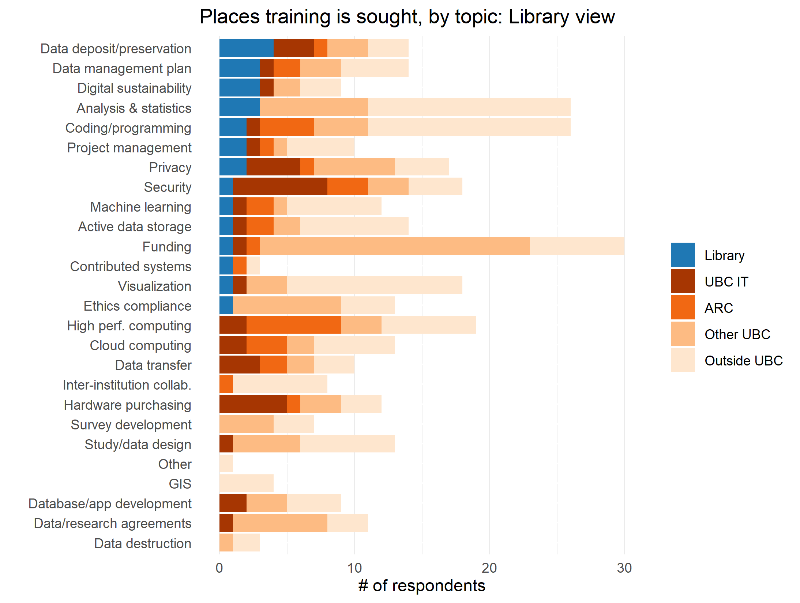

With 13 branches spanning UBC Vancouver, Vancouver General Hospital, and UBC Okanagan, UBC Library supports a range of research activities in diverse and unique contexts. In the context of Digital Research Infrastructure, librarians work with local and national partners to develop access points to research, facilitate deposit of research data, and create training materials to enhance research practices in a digital environment. The library also develops collections and funds platforms that allow researchers to learn about and participate in digital research.

On the Vancouver campus, DRI activities in the realms of RDM, and tools for data visualization, statistical analysis, geospatial inquiries, and text analysis are supported by the Research Commons. On the Okanagan campus, the Centre for Scholarly Communication brings together expertise from the Library, Research Computing, and the Office of Research Services as a single portal to facilitate researcher access to training and support across the full scope of DRI activities queried in the DRI Needs Assessment survey.

UBC Library funds and supports three data repositories: UBC Dataverse, FDRD, and Dryad. UBC Dataverse Collection is our preferred repository with full curational support and a basic digital preservation pipeline. Moreover, the Library has been supporting the campus with Data Management Plans (DMPs) software – DMP Assistant since 2015.  

<a href="#top" class="back-to-top-link">🔝</a>

## Key Findings & Recommendations

 <b>Finding 1</b>
 
Many respondents were either unaware of the RDM supports and training available from the Library and frequently looked outside the Library for RDM supports and training.
  
   
   

  <b>Recommendation 1</b> 
 
 The Library RDM services would benefit greatly from an unified cross-campus strategy to training and support for DRI
 

<b>Finding 2</b>
   
  UBC Library is frequently not the first accessed unit for help across DRI supports and training.
  
   
   

  <b>Recommendation 2</b>
 
UBC Library provides multiple RDM services to campus, including data repositories and training. The Library RDM services would benefit from an unified research data web portal and governance structure to connect all services and departments across the institution that serve DRI, to provide a single point of entry to DRI at UBC.
    

    
    
    
<b>Finding 3</b>
   
  UBC Library RDM services are not clearly known to the community, but these who are aware of them, use them well.
  
   
  <b>Recommendation 3</b>
 
UBC Library RDM services at the current staffing level are not scalable for a campus-wide support. More subject matter expertise for data curation and preservation would be required to provide a scalable service.
    

  
## Highlights

### DRI Support & UBC Library

1. Data management plan (DMP): 24% of researchers who sought support went to UBC Library 
2. Data Retention/deposit/preservation: 16% of researchers who sought support went to UBC Library 
3. Visualization: 14% of researchers who sought support went to UBC Library 

 
**Figure 3.1**

### DRI Training & UBC Library 

1. Data Retention/deposit/preservation: 29% of researchers who sought training went to UBC Library 
2. Data management plan (DMP): 20% of researchers who sought training went to UBC Library 
3. Digital sustainability: 30% of researchers who sought training went to UBC Library 

 
**Figure 3.2**

  
## Discussion

**Training & Support**

There is potential for the Library to grow and improve it's DRI-related instruction program and support model. UBC Library provides graduate level training and faculty support in DRI-related topics including digital scholarship, GIS, RDM, and data analysis. Many of these topics are supported by higher level training and infrastructure from ARC. Additional support and training networks exist within each discipline, spanning institutions, and some researchers indicated that they pay for training outside of UBC. Researchers have noted that training provided by ARC can be too advanced for many audiences. This is an opportunity for the Library to work alongside ARC and UBC departments to develop a training program that collectively supports a range of skill levels.

**Collaborations**

DRI activities depend on expertise and resources that span multiple departments and portfolios, and a key element of success is knowing where this expertise resides. Awareness of training and support, or lack thereof, is a key highlight of this survey. Focus group discussion reinforced the fact that it can be challenging to know where to ask for support at UBC. Increasing collaboration with other UBC units that offer DRI-related training and support could increase the impact of UBC Library's investment in DRI and specifically RDM. In focus groups, researchers indicated that having a single point of contact would reduce the burden of seeking support and training.

**Communications**

Despite the Library's efforts to promote its DRI-related services, many researchers remain unaware of them. Knowing where researchers seek out information related to DRI training and support is critical to increasing awareness and supporting stronger communication strategies. In focus groups, many researchers indicated they learn about DRI support from discipline specific communication channels. A review of communication strategies and complementary communication strategies by units supporting DRI activities on both campuses would enhance awareness of campus supports for DRI.

## Next Steps

UBC Library is a leader in many DRI services - specifically RDM, but also digital scholarship, GIS, data visualization, and data analysis - and is in a strong position to support UBC researchers. Building effective communication strategies and collaborations depends on working relationships between employees, faculty, graduate students, and researchers. However, without executive support to provide guidance and coordination across units and departments, any successes remain rooted in individual commitments and approaches. UBC Library RDM services will benefit from the continuous collaboration with the campus DRI partners and from a unified approach to information sharing, training, and communications.

In line with main report, further information gathering is required to address many of the issues highlighted in this survey. Addressing communication challenges would benefit from richer data from participants on information gathering preferences, a key strength UBC Library could contribute to future collective efforts. UBC Library could also play a central role in formalizing a data collection strategy to inform future intra-institutional collaboration on DRI supports and training.
